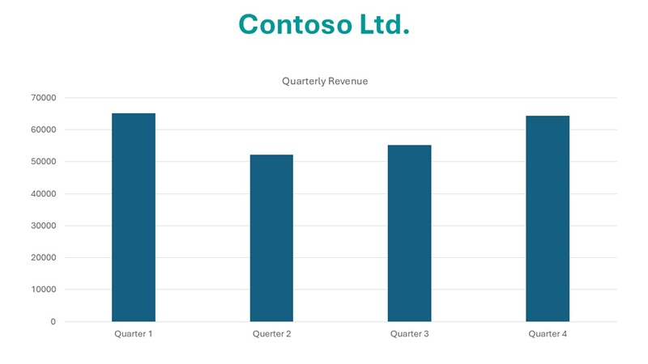

---
lab:
  title: استخراج المعلومات من المحتوى متعدد الوسائط
  description: استفِد من قدرات Azure AI Content Understanding لاستخراج التحليلات من المستندات، والصور، وتسجيلات الصوت، ومقاطع الفيديو.
---

# استخراج المعلومات من المحتوى متعدد الوسائط

في هذا التمرين، يمكنك استخدام Azure Content Understanding لاستخراج المعلومات من مجموعة متنوعة من أنواع المحتوى، بما في ذلك فاتورة، وصورة لشريحة تحتوي على مخططات، وتسجيل صوتي لرسالة صوتية، وتسجيل مرئي لمكالمة جماعية.

يستغرق هذا التدريب حوالي **40** دقيقة.

## إنشاء مركز ومشروع Azure AI Foundry

تتطلب ميزات Azure AI Foundry التي سنستخدمها في هذا التمرين مشروعًا يعتمد على مورد *مركز* Azure AI Foundry.

1. في متصفح الويب، افتح [مدخل Azure AI Foundry](https://ai.azure.com) على `https://ai.azure.com` وسجّل الدخول باستخدام بيانات اعتماد Azure الخاصة بك. أغلق أي تلميحات أو أجزاء التشغيل السريع يتم فتحه عندما تقوم بتسجيل الدخول لأول مرة، وإذا لزم الأمر،استخدم شعار **Azure AI Foundry** في أعلى اليسار للانتقال إلى الصفحة الرئيسية، والتي تبدو مشابهة للصورة التالية (أغلق جزء **المساعدة** إذا كان مفتوحًا):

    

1. في المتصفح، انتقل إلى `https://ai.azure.com/managementCenter/allResources` وحدد **إنشاء جديد**. ثم حدد خيار إنشاء **مورد مركز ذكاء اصطناعي** جديد.
1. في معالج **إنشاء مشروع**، أدخل اسمًا صالحًا لمشروعك، ثم حدد الخيار لإنشاء مركز جديد. بعد ذلك، استخدم رابط **إعادة تسمية المركز** لتحديد اسم صالح للمركز الجديد، ثم وسّع **الخيارات المتقدمة**، وحدد الإعدادات التالية لمشروعك:
    - **Subscription**: *اشتراكك في Azure*
    - **Resource group**: *إنشاء مجموعة موارد أو تحديدها*
    - **المنطقة**:  حدد أحد المواقع التالية (*في وقت الكتابة، تتوفر Azure AI Content understanding فقط في هذه المناطق*):
        - شرق أستراليا
        - منطقة السويد الوسطى
        - غرب الولايات المتحدة

    > **ملاحظة**: إذا كنت تعمل في اشتراك Azure حيث يتم استخدام السياسات لتقييد أسماء الموارد المسموح بها، فقد تحتاج إلى استخدام الرابط الموجود في أسفل مربع المركز **إنشاء مشروع جديد** لإنشاء المركز باستخدام بوابة Azure.

    > **تلميح**: إذا كان زر **إنشاء** لا يزال معطلا، فتأكد من إعادة تسمية مركزك بقيمة أبجدية رقمية فريدة.

1. انتظر حتى يتم إنشاء مشروعك.

## تنزيل محتوى

المحتوى الذي ستقوم بتحليله موجود داخل ملف مؤرشف بصيغة .zip. قم بتنزيله واستخراجه في مجلد محلي.

1. في علامة تبويب جديدة في مستعرض الويب، قم بتنزيل الملف [content.zip](https://github.com/microsoftlearning/mslearn-ai-information-extraction/raw/main/Labfiles/content/content.zip) من `https://github.com/microsoftlearning/mslearn-ai-information-extraction/raw/main/Labfiles/content/content.zip` وحفظه في مجلد محلي.
1. استخرِج الملف *content.zip* الذي تم تنزيله واطّلع على الملفات التي يحتوي عليها. ستستخدم هذه الملفات لإنشاء محللات متعددة لـ Content Understanding ضمن هذا التمرين.

> **ملاحظة**: إذا كنت مهتمًا فقط باستكشاف تحليل نمط معين (مثل، المستندات، أو الصور، أو الفيديو، أو الصوت)، فيمكنك الانتقال مباشرةً إلى المهمة ذات الصلة أدناه. للحصول على أفضل تجربة، يُنصح بالانتقال عبر كل مهمة لمعرفة كيفية استخراج المعلومات من مختلف أنواع المحتوى.

## استخراج المعلومات من مستندات الفواتير

ستقوم بإنشاء محلل Azure AI Content Understanding، يمكنه استخراج المعلومات من الفواتير. ستبدأ بتحديد مخطط استنادًا إلى عينة فاتورة.

### تعريف مخطط لتحليل الفواتير

1. في علامة تبويب مستعرض الويب التي تعرض الصفحة الرئيسية لمشروع Azure AI Foundry، ومن جزء التنقل الموجود على اليسار، حدّد **Content Understanding**.
1. في صفحة **Content Understanding**، حدّد علامة التبويب **المهمة المخصصة** في الأعلى.
1. في صفحة المهمة المخصصة ضمن Content Understanding، حدّد **+ إنشاء**، وأنشئ مهمة بالإعدادات التالية:
    - **اسم المهمة**: `Invoice analysis`
    - **الوصف**: `Extract data from an invoice`
    - **تحليل محتوى ملف واحد**: *محدد*
    - **الإعدادات المتقدمة**:
        - **الاتصال بخدمات الذكاء الاصطناعي في Azure**: *مورد خدمات الذكاء الاصطناعي في Azure ضمن مركز Azure AI Foundry*
        - **حساب تخزين كائن Azure الثنائي كبير الحجم**:*حساب التخزين الافتراضي في مركز مصنع الذكاء الاصطناعي في Azure*
1. انتظر حتى يتم إنشاء المهمة.

    > **تلميح**: إذا حدث خطأ في الوصول إلى التخزين، فانتظر دقيقة وحاول مرة أخرى. قد تستغرق عملية نشر الأذونات لمركز جديد بضع دقائق.

1. في صفحة **تعريف المخطط**، قم بتحميل الملف **invoice-1234.pdf** من المجلد الذي استخرجت منه ملفات المحتوى. يحتوي هذا الملف على الفاتورة التالية:

    

1. في صفحة **تعريف المخطط**، بعد تحميل ملف الفاتورة، حدّد قالب **استخراج بيانات الفاتورة** ثم حدّد **إنشاء**.

    يتضمن قالب *تحليل الفواتير* الحقول الشائعة التي توجد عادةً في الفواتير. يمكنك استخدام محرر المخطط لحذف أيٍّ من الحقول المقترحة التي لا تحتاج إليها، وإضافة أي حقول مخصصة تستخدمها.

1. في قائمة الحقول المقترحة، حدد **BillingAddress**. هذا الحقل غير مطلوب لتنسيق الفاتورة الذي قمت بتحميله، لذا استخدم أيقونة **حذف الحقل** (**&#128465;**) التي تظهر في صف الحقل لحذفه.
1. الآن، احذف الحقول المقترحة التالية، فهي غير ضرورية لمخطط الفاتورة:
    - عنوان المرسل إليه الفاتورة
    - عنوان مراسلة العميل
    - Customerid
    - CustomerTaxId
    - DueDate
    - إجمالي الفاتورة
    - PaymentTerm
    - الرصيد السابق غير المدفوع
    - PurchaseOrder
    - عنوان التحويلات
    - عنوان متلقي التحويلات
    - ServiceAddress
    - عنوان متلقي الخدمة
    - ShippingAddress
    - عنوان مراسلة الشحن
    - TotalDiscount
    - عنوان مراسلة البائع
    - VendorTaxId
    - TaxDetails
1. استخدم زر **+ إضافة حقل جديد** لإضافة الحقول التالية، مع تحديد **حفظ التغييرات** (**#10003;**) لكل حقل جديد:

    | اسم الحقل | وصف الحقل | نوع القيمة | الأسلوب |
    |--|--|--|--|
    | `VendorPhone` | `Vendor telephone number` | السلسلة‬ | الاستخراج |
    | `ShippingFee` | `Fee for shipping` | الرقم‬ | الاستخراج |

1. في صف حقل **العناصر**، لاحظ أن هذا الحقل عبارة عن *جدول* (يحتوي على مجموعة العناصر المدرجة في الفاتورة). حدد أيقونة **تحرير** (&#9638;) لفتح صفحة جديدة تحتوي على الحقول الفرعية الخاصة بها.
1. أزِل الحقول الفرعية التالية من جدول **العناصر**:
    - التاريخ
    - ProductCode
    - الوحدة
    - TaxAmount
    - TaxRate
1. استخدم زر **أوافق** لتأكيد التغييرات والعودة إلى المستوى الأعلى في مخطط الفاتورة.

1. تحقّق من أن المخطط النهائي يبدو كما يلي، ثم حدّد **حفظ**.

    

1. في صفحة **محلل الاختبار**، إذا لم يبدأ التحليل تلقائيًا، فحدد **تشغيل التحليل**. ثم انتظر حتى يكتمل التحليل.

1. راجع نتائج التحليل، والتي يجب أن تبدو مشابهة لهذا:

    

1. عرض تفاصيل الحقول التي تم تحديدها في جزء **الحقول**.

### إنشاء محلل الفواتير واختباره

والآن، بعد تدريب نموذج لاستخراج الحقول من الفواتير، يمكنك بناء محلل لاستخدامه مع المستندات المشابهة.

1. حدّد صفحة **قائمة المحلل**، ثم حدّد **+ إنشاء محلل** وأنشئ محللًا جديدًا بالخصائص التالية (يجب كتابتها تمامًا كما هي معروضة):
    - **الاسم:** `invoice-analyzer`
    - **الوصف**: `Invoice analyzer`
1. انتظر حتى يصبح المحلل الجديد جاهزًا (استخدم زر **تحديث** للتحقق).
1. عند إنشاء المحلل، حدّد رابط **invoice-analyzer**. سيتم عرض الحقول المحددة في مخطط المحلل.
1. في صفحة **invoice-analyzer**، حدّد علامة تبويب **اختبار**.
1. استخدم الزر **+ تحميل ملفات الاختبار** لتحميل الملف **invoice-1235.pdf** من المجلد حيث قمت باستخراج ملفات المحتوى، ثم انقر على **تشغيل التحليل** لاستخراج بيانات الحقول من الفاتورة.

    تبدو الفاتورة التي يتم تحليلها كما يلي:

    

1. راجع جزء **الحقول**، وتحقق من أن المحلل استخرج الحقول الصحيحة من فاتورة الاختبار.
1. راجع جزء **النتائج** للاطّلاع على استجابة JSON التي قد يعيدها المحلل إلى تطبيق العميل.
1. في علامة التبويب **نموذج التعليمات البرمجية**، اطّلع على عينة التعليمات البرمجية التي يمكنك استخدامها لتطوير تطبيق عميل يستخدم واجهة Content Understanding REST لاستدعاء المحلل الخاص بك.
1. أغلِق صفحة **invoice-analyzer**.

## استخراج المعلومات من صورة شريحة

ستقوم بإنشاء محلل Azure AI Content Understanding الذي يمكنه استخراج المعلومات من شريحة تحتوي على مخططات.

### تعريف مخطط لتحليل الصورة

1. في علامة تبويب مستعرض الويب التي تعرض الصفحة الرئيسية لمشروع Azure AI Foundry، ومن جزء التنقل الموجود على اليسار، حدّد **Content Understanding**.
1. في صفحة **Content Understanding**، حدّد علامة التبويب **المهمة المخصصة** في الأعلى.
1. في صفحة المهمة المخصصة ضمن Content Understanding، حدّد **+ إنشاء**، وأنشئ مهمة بالإعدادات التالية:
    - **اسم المهمة**: `Slide analysis`
    - **الوصف**: `Extract data from an image of a slide`
    - **تحليل محتوى ملف واحد**: *محدد*
    - **الإعدادات المتقدمة**:
        - **الاتصال بخدمات الذكاء الاصطناعي في Azure**: *مورد خدمات الذكاء الاصطناعي في Azure ضمن مركز Azure AI Foundry*
        - **حساب تخزين كائن Azure الثنائي كبير الحجم**:*حساب التخزين الافتراضي في مركز مصنع الذكاء الاصطناعي في Azure*
1. انتظر حتى يتم إنشاء المهمة.

    > **تلميح**: إذا حدث خطأ في الوصول إلى التخزين، فانتظر دقيقة وحاول مرة أخرى. قد تستغرق عملية نشر الأذونات لمركز جديد بضع دقائق.

1. في صفحة **تعريف المخطط**، قم بتحميل الملف **slide-1.jpg** من المجلد الذي استخرجت منه ملفات المحتوى. ثم حدّد قالب **تحليل الصور** وحدّد **إنشاء**.

    لا يتضمن قالب *تحليل الصور* أي حقول معرّفة مسبقًا. يجب تحديد الحقول التي تصف المعلومات المطلوب استخراجها.

1. استخدم زر **+ إضافة حقل جديد** لإضافة الحقول التالية، مع تحديد **حفظ التغييرات** (**#10003;**) لكل حقل جديد:

    | اسم الحقل | وصف الحقل | نوع القيمة | الأسلوب |
    |--|--|--|--|
    | `Title` | `Slide title` | السلسلة‬ | إنشاء |
    | `Summary` | `Summary of the slide` | السلسلة‬ | إنشاء |
    | `Charts` | `Number of charts on the slide` | رقم صحيح | إنشاء |

1. استخدم زر **+ إضافة حقل جديد** لإضافة حقل جديد باسم `QuarterlyRevenue` والوصف `Revenue per quarter` على أن يكون نوع القيمة **جدول**، ثم احفظ الحقل الجديد (**&#10003;**). بعد ذلك، وفي الصفحة الجديدة التي تُفتح لحقول الجدول الفرعية، أضِف الحقول التالية:

    | اسم الحقل | وصف الحقل | نوع القيمة | الأسلوب |
    |--|--|--|--|
    | `Quarter` | `Which quarter?` | السلسلة‬ | إنشاء |
    | `Revenue` | `Revenue for the quarter` | الرقم‬ | إنشاء |

1. حدّد **رجوع** (أيقونة السهم بالقرب من زر **إضافة حقل فرعي جديد**) أو **موافق &#10003;** للعودة إلى المستوى الأعلى في المخطط، ثم استخدم زر **+ إضافة حقل جديد** لإضافة حقل جديد باسم `ProductCategories` والوصف `Product categories` على أن يكون نوع القيمة **جدول**، ثم احفظ الحقل الجديد (**&10003;**). بعد ذلك، وفي الصفحة الجديدة التي تُفتح لحقول الجدول الفرعية، أضِف الحقول التالية:

    | اسم الحقل | وصف الحقل | نوع القيمة | الأسلوب |
    |--|--|--|--|
    | `ProductCategory` | `Product category name` | السلسلة‬ | إنشاء |
    | `RevenuePercentage` | `Percentage of revenue` | الرقم‬ | إنشاء |

1. حدّد **رجوع** (أيقونة السهم بالقرب من زر **الزر "إضافة حقل** فرعي جديد") أو **موافق &#10003;** للعودة إلى المستوى الأعلى في المخطط، ثم تأكّد من أنه مطابق لما يلي. ثم حدد **حفظ**.

    

1. في صفحة **محلل الاختبار**، إذا لم يبدأ التحليل تلقائيًا، فحدد **تشغيل التحليل**. ثم انتظر حتى يكتمل التحليل.

    تبدو الشريحة التي يتم تحليلها كما يلي:

    

1. راجع نتائج التحليل، والتي يجب أن تبدو مشابهة لهذا:

    

1. اطّلع على تفاصيل الحقول التي تم تحديدها في جزء **الحقول**، وقم بتوسيع الحقلين **QuarterlyRevenue** و**ProductCategories** للاطّلاع على قيم الحقل الفرعي.

### إنشاء محلل واختباره

والآن، بعد تدريب نموذج لاستخراج الحقول من الشرائح، يمكنك إنشاء محلل لاستخدامه مع صور الشرائح المشابهة.

1. حدّد صفحة **قائمة المحلل**، ثم حدّد **+ إنشاء محلل** وأنشئ محللًا جديدًا بالخصائص التالية (يجب كتابتها تمامًا كما هي معروضة):
    - **الاسم:** `slide-analyzer`
    - **الوصف**: `Slide image analyzer`
1. انتظر حتى يصبح المحلل الجديد جاهزًا (استخدم زر **تحديث** للتحقق).
1. عند إنشاء المحلل، حدّد رابط **slide-analyzer**. سيتم عرض الحقول المحددة في مخطط المحلل.
1. في صفحة **slide-analyzer**، حدّد علامة التبويب **اختبار**.
1. استخدم الزر **+ تحميل ملفات الاختبار** لتحميل الملف **slide-2.jpg** من المجلد حيث قمت باستخراج ملفات المحتوى، ثم انقر على **تشغيل التحليل** لاستخراج بيانات الحقول من الصورة.

    تبدو الشريحة التي يتم تحليلها كما يلي:

    

1. راجع جزء **الحقول**، وتحقق من أن المحلل استخرج الحقول الصحيحة من صورة الشريحة.

    > **ملاحظة**: لا تتضمن الشريحة 2 تفصيلًا حسب فئة المنتج، ولذلك فإن بيانات إيرادات فئة المنتج غير متوفرة.

1. راجع جزء **النتائج** للاطّلاع على استجابة JSON التي قد يعيدها المحلل إلى تطبيق العميل.
1. في علامة التبويب **نموذج التعليمات البرمجية**، اطّلع على عينة التعليمات البرمجية التي يمكنك استخدامها لتطوير تطبيق عميل يستخدم واجهة Content Understanding REST لاستدعاء المحلل الخاص بك.
1. أغلِق صفحة **slide-analyzer**.

## استخراج المعلومات من تسجيل صوتي بالبريد الصوتي

ستقوم بإنشاء محلل Azure AI Content Understanding الذي يمكنه استخراج المعلومات من تسجيل صوتي لرسالة بريد صوتي.

### تعريف مخطط لتحليل الصوت

1. في علامة تبويب مستعرض الويب التي تعرض الصفحة الرئيسية لمشروع Azure AI Foundry، ومن جزء التنقل الموجود على اليسار، حدّد **Content Understanding**.
1. في صفحة **Content Understanding**، حدّد علامة التبويب **المهمة المخصصة** في الأعلى.
1. في صفحة المهمة المخصصة ضمن Content Understanding، حدّد **+ إنشاء**، وأنشئ مهمة بالإعدادات التالية:
    - **اسم المهمة**: `Voicemail analysis`
    - **الوصف**: `Extract data from a voicemail recording`
    - **تحليل محتوى ملف واحد**: *محدد*
    - **الإعدادات المتقدمة**:
        - **الاتصال بخدمات الذكاء الاصطناعي في Azure**: *مورد خدمات الذكاء الاصطناعي في Azure ضمن مركز Azure AI Foundry*
        - **حساب تخزين كائن Azure الثنائي كبير الحجم**:*حساب التخزين الافتراضي في مركز مصنع الذكاء الاصطناعي في Azure*
1. انتظر حتى يتم إنشاء المهمة.

    > **تلميح**: إذا حدث خطأ في الوصول إلى التخزين، فانتظر دقيقة وحاول مرة أخرى. قد تستغرق عملية نشر الأذونات لمركز جديد بضع دقائق.

1. في صفحة **تعريف المخطط**، قم بتحميل الملف **call-1.mp3** من المجلد الذي استخرجت منه ملفات المحتوى. ثم حدّد قالب **تحليل النص المنطوق** وحدّد **إنشاء**.
1. في جزء **المحتوى** على الجانب الأيسر، حدّد **معاينة النسخة المكتوبة** للاطّلاع على نسخة مكتوبة من الرسالة المسجلة.

    لا يتضمن قالب *تحليل النص المنطوق* أي حقول معرّفة مسبقًا. يجب تحديد الحقول التي تصف المعلومات المطلوب استخراجها.

1. استخدم زر **+ إضافة حقل جديد** لإضافة الحقول التالية، مع تحديد **حفظ التغييرات** (**#10003;**) لكل حقل جديد:

    | اسم الحقل | وصف الحقل | نوع القيمة | الأسلوب |
    |--|--|--|--|
    | `Caller` | `Person who left the message` | السلسلة‬ | إنشاء |
    | `Summary` | `Summary of the message` | السلسلة‬ | إنشاء |
    | `Actions` | `Requested actions` | السلسلة‬ | إنشاء |
    | `CallbackNumber` | `Telephone number to return the call` | السلسلة‬ | إنشاء |
    | `AlternativeContacts` | `Alternative contact details` | قائمة السلاسل النصية | إنشاء |

1. تحقق من أن المخطط الخاص بك يبدو على هذا النحو. ثم حدد **حفظ**.

    

1. في صفحة **محلل الاختبار**، إذا لم يبدأ التحليل تلقائيًا، فحدد **تشغيل التحليل**. ثم انتظر حتى يكتمل التحليل.

    قد يستغرق تحليل الصوت بعض الوقت. في أثناء الانتظار، يمكنك تشغيل الملف الصوتي أدناه:

    <video controls src="https://github.com/MicrosoftLearning/mslearn-ai-information-extraction/raw/refs/heads/main/Instructions/Labs/media/call-1.mp4" title="المكالمة 1" width="300">
        <track src="https://github.com/MicrosoftLearning/mslearn-ai-information-extraction/raw/refs/heads/main/Instructions/Labs/media/call-1.vtt" kind="captions" srclang="en" label="English">
    </video>

    **ملاحظة**: تم إنشاء هذا الملف الصوتي باستخدام الذكاء الاصطناعي.

1. راجع نتائج التحليل، والتي يجب أن تبدو مشابهة لهذا:

    

1. اطّلع على تفاصيل الحقول التي تم تحديدها في جزء **الحقول**، لتوسيع حقل **AlternativeContacts** لعرض القيم المدرجة.

### إنشاء محلل واختباره

والآن، بعد تدريب نموذج لاستخراج الحقول من الرسائل الصوتية، يمكنك إنشاء محلل لاستخدامه مع تسجيلات صوتية مشابهة.

1. حدّد صفحة **قائمة المحلل**، ثم حدّد **+ إنشاء محلل** وأنشئ محللًا جديدًا بالخصائص التالية (يجب كتابتها تمامًا كما هي معروضة):
    - **الاسم:** `voicemail-analyzer`
    - **الوصف**: `Voicemail audio analyzer`
1. انتظر حتى يصبح المحلل الجديد جاهزًا (استخدم زر **تحديث** للتحقق).
1. عند إنشاء المحلل، حدّد رابط **voicemail-analyzer**. سيتم عرض الحقول المحددة في مخطط المحلل.
1. في صفحة **voicemail-analyzer**، حدّد علامة التبويب **الاختبار**.
1. استخدم الزر **+ تحميل ملفات الاختبار** لتحميل الملف **call-2.mp3** من المجلد حيث قمت باستخراج ملفات المحتوى، ثم انقر على **تشغيل التحليل** لاستخراج بيانات الحقول من الملف الصوتي.

    قد يستغرق تحليل الصوت بعض الوقت. في أثناء الانتظار، يمكنك تشغيل الملف الصوتي أدناه:

    <video controls src="https://github.com/MicrosoftLearning/mslearn-ai-information-extraction/raw/refs/heads/main/Instructions/Labs/media/call-2.mp4" title="المكالمة 2" width="300">
        <track src="https://github.com/MicrosoftLearning/mslearn-ai-information-extraction/raw/refs/heads/main/Instructions/Labs/media/call-2.vtt" kind="captions" srclang="en" label="English">
    </video>

    **ملاحظة**: تم إنشاء هذا الملف الصوتي باستخدام الذكاء الاصطناعي.

1. راجع جزء **الحقول**، وتحقق من أن المحلل استخرج الحقول الصحيحة من الرسالة الصوتية.
1. راجع جزء **النتائج** للاطّلاع على استجابة JSON التي قد يعيدها المحلل إلى تطبيق العميل.
1. في علامة التبويب **نموذج التعليمات البرمجية**، اطّلع على عينة التعليمات البرمجية التي يمكنك استخدامها لتطوير تطبيق عميل يستخدم واجهة Content Understanding REST لاستدعاء المحلل الخاص بك.
1. أغلِق صفحة **voicemail-analyzer**.

## استخراج المعلومات من تسجيل مكالمة فيديو

ستقوم بإنشاء محلل Azure AI Content Understanding الذي يمكنه استخراج المعلومات من تسجيل فيديو لمكالمة جماعية.

### تعريف مخطط لتحليل الفيديو

1. في علامة تبويب مستعرض الويب التي تعرض الصفحة الرئيسية لمشروع Azure AI Foundry، ومن جزء التنقل الموجود على اليسار، حدّد **Content Understanding**.
1. في صفحة **Content Understanding**، حدّد علامة التبويب **المهمة المخصصة** في الأعلى.
1. في صفحة المهمة المخصصة ضمن Content Understanding، حدّد **+ إنشاء**، وأنشئ مهمة بالإعدادات التالية:
    - **اسم المهمة**: `Conference call video analysis`
    - **الوصف**: `Extract data from a video conference recording`
    - **تحليل محتوى ملف واحد**: *محدد*
    - **الإعدادات المتقدمة**:
        - **الاتصال بخدمات الذكاء الاصطناعي في Azure**: *مورد خدمات الذكاء الاصطناعي في Azure ضمن مركز Azure AI Foundry*
        - **حساب تخزين كائن Azure الثنائي كبير الحجم**:*حساب التخزين الافتراضي في مركز مصنع الذكاء الاصطناعي في Azure*
1. انتظر حتى يتم إنشاء المهمة.

    > **تلميح**: إذا حدث خطأ في الوصول إلى التخزين، فانتظر دقيقة وحاول مرة أخرى. قد تستغرق عملية نشر الأذونات لمركز جديد بضع دقائق.

1. في صفحة **تعريف المخطط**، قم بتحميل الملف **meeting-1.mp4** من المجلد الذي استخرجت منه ملفات المحتوى. ثم حدّد قالب **تحليل الفيديو** وحدّد **إنشاء**.
1. في جزء **المحتوى** على الجانب الأيسر، حدّد **معاينة النسخة المكتوبة** للاطّلاع على نسخة مكتوبة من الرسالة المسجلة.

    يستخرج قالب *تحليل الفيديو* بيانات الفيديو. لا يتضمن أي حقول معرّفة مسبقًا. يجب تحديد الحقول التي تصف المعلومات المطلوب استخراجها.

1. استخدم زر **+ إضافة حقل جديد** لإضافة الحقول التالية، مع تحديد **حفظ التغييرات** (**#10003;**) لكل حقل جديد:

    | اسم الحقل | وصف الحقل | نوع القيمة | الأسلوب |
    |--|--|--|--|
    | `Summary` | `Summary of the discussion` | السلسلة‬ | إنشاء |
    | `Participants` | `Count of meeting participants` | رقم صحيح | إنشاء |
    | `ParticipantNames` | `Names of meeting participants` | قائمة السلاسل النصية | إنشاء |
    | `SharedSlides` | `Descriptions of any PowerPoint slides presented` | قائمة السلاسل النصية | إنشاء |
    | `AssignedActions` | `Tasks assigned to participants` | جدول |  |

1. عند إدخال الحقل **AssignedActions**، في جدول الحقول الفرعية التي تظهر، قم بإنشاء الحقول الفرعية التالية:

    | اسم الحقل | وصف الحقل | نوع القيمة | الأسلوب |
    |--|--|--|--|
    | `Task` | `Description of the task` | السلسلة‬ | إنشاء |
    | `AssignedTo` | `Who the task is assigned to` | السلسلة‬ | إنشاء |

1. حدّد **رجوع** (أيقونة السهم بالقرب من زر **الزر "إضافة حقل** فرعي جديد") أو **موافق &#10003;** للعودة إلى المستوى الأعلى في المخطط، ثم تأكّد من أنه مطابق لما يلي. ثم حدد **حفظ**.

1. تحقق من أن المخطط الخاص بك يبدو على هذا النحو. ثم حدد **حفظ**.

    

1. في صفحة **محلل الاختبار**، إذا لم يبدأ التحليل تلقائيًا، فحدد **تشغيل التحليل**. ثم انتظر حتى يكتمل التحليل.

    قد يستغرق تحليل الفيديو بعض الوقت. في أثناء الانتظار، يمكنك عرض الفيديو أدناه:

    <video controls src="https://github.com/MicrosoftLearning/mslearn-ai-information-extraction/raw/refs/heads/main/Instructions/Labs/media/meeting-1.mp4" title="الاجتماع 1" width="480">
        <track src="https://github.com/MicrosoftLearning/mslearn-ai-information-extraction/raw/refs/heads/main/Instructions/Labs/media/meeting-1.vtt" kind="captions" srclang="en" label="English">
    </video>

    **ملاحظة**: تم إنشاء هذا الفيديو باستخدام الذكاء الاصطناعي.

1. عند اكتمال التحليل، راجع النتائج، التي يجب أن تبدو مماثلة لما يلي:

    

1. في جزء **الحقول**، اطّلع على البيانات المستخرجة للفيديو، بما في ذلك الحقول التي أضفتها. اطّلع على قيم الحقول التي تم إنشاؤها، مع توسيع حقول القوائم والجدول حسب الحاجة.

### إنشاء محلل واختباره

والآن، بعد تدريب نموذج لاستخراج الحقول من تسجيلات المكالمات الجماعية، يمكنك إنشاء محلل لاستخدامه مع مقاطع فيديو مشابهة.

1. حدّد صفحة **قائمة المحلل**، ثم حدّد **+ إنشاء محلل** وأنشئ محللًا جديدًا بالخصائص التالية (يجب كتابتها تمامًا كما هي معروضة):
    - **الاسم:** `conference-call-analyzer`
    - **الوصف**: `Conference call video analyzer`
1. انتظر حتى يصبح المحلل الجديد جاهزًا (استخدم زر **تحديث** للتحقق).
1. عند إنشاء المحلل، حدّد رابط **conference-call-analyzer**. سيتم عرض الحقول المحددة في مخطط المحلل.
1. في صفحة **conference-call-analyzer**، حدّد علامة التبويب **الاختبار**.
1. استخدم الزر **+ تحميل ملفات الاختبار** لتحميل الملف **meeting-2.mp4** من المجلد الذي استخرجت منه ملفات المحتوى، وشغّل التحليل لاستخراج بيانات الحقول من الملف الصوتي.

    قد يستغرق تحليل الفيديو بعض الوقت. في أثناء الانتظار، يمكنك عرض الفيديو أدناه:

    <video controls src="https://github.com/MicrosoftLearning/mslearn-ai-information-extraction/raw/refs/heads/main/Instructions/Labs/media/meeting-2.mp4" title="الاجتماع 2" width="480">
        <track src="https://github.com/MicrosoftLearning/mslearn-ai-information-extraction/raw/refs/heads/main/Instructions/Labs/media/meeting-2.vtt" kind="captions" srclang="en" label="English">
    </video>

    **ملاحظة**: تم إنشاء هذا الفيديو باستخدام الذكاء الاصطناعي.

1. راجع جزء **الحقول**، واطّلع على الحقول التي استخرجها المحلل لفيديو المكالمة الجماعية.
1. راجع جزء **النتائج** للاطّلاع على استجابة JSON التي قد يعيدها المحلل إلى تطبيق العميل.
1. أغلِق صفحة **conference-call-analyzer**.

## تنظيف

إذا انتهيت من العمل باستخدام خدمة "فهم المحتوى"، فيجب عليك حذف الموارد التي قمت بإنشائها في هذا التمرين لتجنب تكبد تكاليف Azure غير الضرورية.

1. في مدخل Azure AI Foundry، انتقل إلى مركزك، في صفحة النظرة العامة، حدّد مشروعك ثم احذفه.
1. في بوابة Azure، انتقل إلى مجموعة الموارد التي أنشأتها لهذه التدريبات.
