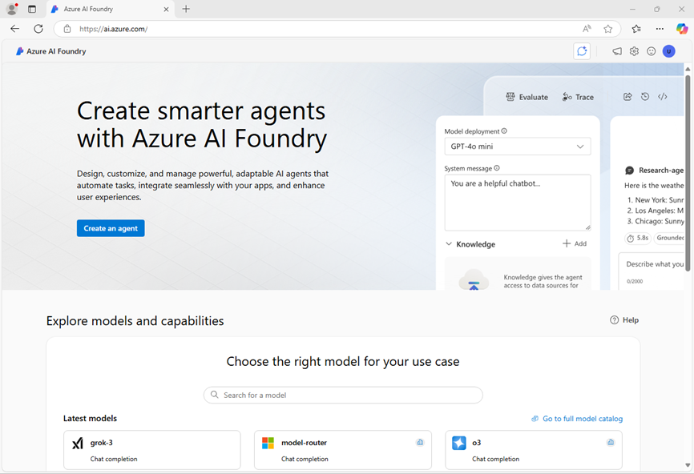

---
lab:
  title: تحليل النماذج باستخدام نماذج التحليل الذكي للمستندات مسبقة البناء من الذكاء الاصطناعي في Azure
  description: استخدم نماذج Azure AI Document Intelligence المعدة مسبقًا لمعالجة الحقول النصية من المستندات.
---

# تحليل النماذج باستخدام نماذج التحليل الذكي للمستندات مسبقة البناء من الذكاء الاصطناعي في Azure

في هذا التمرين، ستقوم بإعداد مشروع Azure AI Foundry بجميع الموارد اللازمة لتحليل المستند. ستستخدم كلًّا من مدخل Azure AI Foundry وحزمة Python SDK لإرسال النماذج إلى هذا المورد لتحليلها.

على الرغم من أن هذا التمرين يستند إلى Python، يمكنك تطوير تطبيقات مماثلة باستخدام حزم SDK مخصصة للغات برمجة متعددة، منها:

- [مكتبة عميل Azure AI Document Intelligence لـ Python](https://pypi.org/project/azure-ai-formrecognizer/)
- [مكتبة عميل Azure AI Document Intelligence لـ Microsoft .NET](https://www.nuget.org/packages/Azure.AI.FormRecognizer)
- [مكتبة عميل Azure AI Document Intelligence لـ JavaScript](https://www.npmjs.com/package/@azure/ai-form-recognizer)

سيستغرق هذا التدريب حوالي **30** دقيقة.

## إنشاء مشروع في مصنع الذكاء الاصطناعي في Azure

دعنا نبدأ بإنشاء مشروع في مصنع الذكاء الاصطناعي في Azure.

1. في متصفح الويب، افتح [مدخل Azure AI Foundry](https://ai.azure.com) على `https://ai.azure.com` وسجّل الدخول باستخدام بيانات اعتماد Azure الخاصة بك. أغلق أي تلميحات أو أجزاء التشغيل السريع يتم فتحه عندما تقوم بتسجيل الدخول لأول مرة، وإذا لزم الأمر،استخدم شعار **Azure AI Foundry** في أعلى اليسار للانتقال إلى الصفحة الرئيسية، والتي تبدو مشابهة للصورة التالية (أغلق جزء **المساعدة** إذا كان مفتوحًا):

    

1. في المتصفح، انتقل إلى `https://ai.azure.com/managementCenter/allResources` وحدد **إنشاء جديد**. ثم حدد خيار إنشاء **مورد مركز ذكاء اصطناعي** جديد.
1. في معالج **إنشاء مشروع**، أدخل اسمًا صالحًا لمشروعك، ثم حدد الخيار لإنشاء مركز جديد. بعد ذلك، استخدم رابط **إعادة تسمية المركز** لتحديد اسم صالح للمركز الجديد، ثم وسّع **الخيارات المتقدمة**، وحدد الإعدادات التالية لمشروعك:
    - **Subscription**: *اشتراكك في Azure*
    - **Resource group**: *إنشاء مجموعة موارد أو تحديدها*
    - **المنطقة**:  *أي منطقة متاحة*

    > **ملاحظة**: إذا كنت تعمل في اشتراك Azure حيث يتم استخدام السياسات لتقييد أسماء الموارد المسموح بها، فقد تحتاج إلى استخدام الرابط الموجود في أسفل مربع المركز **إنشاء مشروع جديد** لإنشاء المركز باستخدام بوابة Azure.

    > **تلميح**: إذا كان زر **إنشاء** لا يزال معطلا، فتأكد من إعادة تسمية مركزك بقيمة أبجدية رقمية فريدة.

1. انتظر حتى يتم إنشاء مشروعك.
1. عند إنشاء مشروعك، أغلق أي تلميحات يتم عرضها وراجع صفحة المشروع في مدخل مصنع الذكاء الاصطناعي في Azure، والذي يجب أن يبدو مشابهة للصورة التالية:

    

## استخدام نموذج القراءة

لنبدأ باستخدام مدخل **Azure AI Foundry** ونموذج القراءة لتحليل مستند بلغات متعددة:

1. في لوحة التنقل على اليمين، حدّد **AI Services**.
1. في صفحة **Azure AI Services** حدّد لوحة **Vision + Document**.
1. في صفحة **Vision + Document**، تحقق من تحديد علامة التبويب **المستند**، ثم حدّد لوحة **OCR/Read**.

    في صفحة **القراءة**، يجب أن يكون مورد Azure AI Services الذي تم إنشاؤه مع مشروعك متصلًا بالفعل.

1. في قائمة المستندات على اليسار، حدد **read-german.pdf**.

    

1. في شريط الأدوات العلوي، حدّد **خيارات التحليل**، ثم قم بتمكين مربع اختيار **اللغة** (ضمن **الكشف الاختياري**) في جزء **خيارات التحليل** ثم حدّد **حفظ**. 
1. في الجزء العلوي الأيسر، حدد **تشغيل التحليل**.
1. عند اكتمال التحليل، يظهر النص المستخرج من الصورة على اليمين في علامة التبويب **المحتوى**. راجع هذا النص وقارنه بالنص الموجود في الصورة الأصلية للتأكد من دقته.
1. حدد علامة التبويب **Result**. تعرض علامة التبويب هذه التعليمات البرمجية JSON المستخرجة. 

## الإعداد لتطوير تطبيق في Cloud Shell

الآن دعونا نستكشف التطبيق الذي يستخدم SDK لخدمة Azure Document Intelligence. ستقوم بتطوير تطبيقك باستخدام Cloud Shell. تم توفير ملفات التعليمات البرمجية لتطبيقك في GitHub repo.

هذه هي الفاتورة التي ستحللها التعليمة البرمجية.


1. في مدخل مصنع الذكاء الاصطناعي في Azure، اعرض صفحة **النظرة العامة** لمشروعك.
1. في منطقة **نقاط النهاية والمفاتيح**، حدّد علامة التبويب **Azure AI Services**، واحفظ **مفتاح API** و**نقطة نهاية Azure AI Services**. ستستخدم بيانات الاعتماد هذه للاتصال بـ Azure AI Services من خلال تطبيق العميل.
1. افتح علامة تبويب جديدة للمتصفح (مع إبقاء مدخل مصنع الذكاء الاصطناعي في Azure مفتوحًا في علامة التبويب الموجودة). بعد ذلك في علامة التبويب الجديدة، انتقل إلى [بوابة Azure](https://portal.azure.com) على `https://portal.azure.com`؛ وسجّل الدخول باستخدام بيانات اعتماد Azure الخاصة بك إذا طُلب منك ذلك.
1. استخدم الزر **[\>_]** الموجود على يمين شريط البحث أعلى الصفحة لإنشاء Cloud Shell جديد في بوابة Azure، وتحديد بيئة ***PowerShell***. يوفّر Cloud Shell واجهة سطر أوامر في جزء أسفل بوابة Azure.

    > **ملاحظة**: إذا كنت قد أنشأت مسبقًا Cloud Shell يستخدم بيئة *معالج Bash*، فبدّل إلى ***PowerShell***.

1. في شريط أدوات Cloud Shell، في قائمة **الإعدادات**، حدد **الانتقال إلى الإصدار الكلاسيكي** (هذا مطلوب لاستخدام محرر التعليمات البرمجية).

    **<font color="red">تأكد من التبديل إلى الإصدار الكلاسيكي من cloud shell قبل المتابعة.</font>**

1. في جزء PowerShell، أدخل الأوامر التالية لاستنساخ مستودع GitHub لهذا التمرين:

    ```
   rm -r mslearn-ai-info -f
   git clone https://github.com/microsoftlearning/mslearn-ai-information-extraction mslearn-ai-info
    ```

    > **تلميح**: عند لصق الأوامر في CloudShell، قد يشغل الإخراج مساحة كبيرة من ذاكرة التخزين المؤقت للشاشة. يمكنك مسح الشاشة عن طريق إدخال الأمر `cls` لتسهيل التركيز على كل مهمة.

    ***الآن اتبع الخطوات الخاصة بلغة البرمجة التي اخترتها.***

1. بعد استنساخ المستودع، انتقل إلى المجلد الذي يحتوي على ملفات التعليمات البرمجية:

    ```
   cd mslearn-ai-info/Labfiles/prebuilt-doc-intelligence/Python
    ```

1. في جزء سطر أوامر Cloud Shell، أدخل الأمر التالي لتثبيت المكتبات التي ستستخدمها:

    ```
   python -m venv labenv
   ./labenv/bin/Activate.ps1
   pip install -r requirements.txt azure-ai-formrecognizer==3.3.3
    ```

1. أدخل الأمر التالي لتحرير ملف التكوين الذي تم توفيره:

    ```
   code .env
    ```

    يتم فتح الملف في محرر التعليمات البرمجية.

1. في ملف التعليمات البرمجية، استبدل العنصرين النائبين **YOUR_ENDPOINT** و**YOUR_KEY** بنقطة نهاية Azure AI Services ومفتاح API الخاص بها (تم النسخ من مدخل Azure AI Foundry).
1. بعد استبدال العناصر النائبة في محرر التعليمات البرمجية، استخدم الأمر **CTRL+S** لحفظ التغييرات ثم استخدم الأمر **CTRL+Q** لإغلاق محرر التعليمات البرمجية مع إبقاء سطر أوامر Cloud Shell مفتوحًا.

## إضافة التعليمة البرمجية لاستخدام خدمة Azure Document Intelligence

أنت الآن جاهز لاستخدام SDK لتقييم ملف pdf.

1. أدخِل الأمر التالي لتعديل ملف التطبيق المُرفَق:

    ```
   code document-analysis.py
    ```

    يتم فتح الملف في محرر التعليمات البرمجية.

1. في ملف التعليمات البرمجية، ابحث عن التعليق **استيراد المكتبات المطلوبة** وأضِف التعليمات البرمجية التالية:

    ```python
   # Add references
   from azure.core.credentials import AzureKeyCredential
   from azure.ai.formrecognizer import DocumentAnalysisClient
    ```

1. ابحث عن التعليق **إنشاء العميل** وأضِف التعليمات البرمجية التالية (مع الحرص على الحفاظ على مستوى المسافة البادئة الصحيح):

    ```python
   # Create the client
   document_analysis_client = DocumentAnalysisClient(
        endpoint=endpoint, credential=AzureKeyCredential(key)
   )
    ```

1. ابحث عن التعليق **تحليل الفاتورة** وأضِف التعليمات البرمجية التالية:

    ```python
   # Analyse the invoice
   poller = document_analysis_client.begin_analyze_document_from_url(
        fileModelId, fileUri, locale=fileLocale
   )
    ```

1. ابحث عن التعليق **عرض معلومات الفاتورة للمستخدم**وأضِف التعليمات البرمجية التالية:

    ```python
   # Display invoice information to the user
   receipts = poller.result()
    
   for idx, receipt in enumerate(receipts.documents):
    
        vendor_name = receipt.fields.get("VendorName")
        if vendor_name:
            print(f"\nVendor Name: {vendor_name.value}, with confidence {vendor_name.confidence}.")

        customer_name = receipt.fields.get("CustomerName")
        if customer_name:
            print(f"Customer Name: '{customer_name.value}, with confidence {customer_name.confidence}.")


        invoice_total = receipt.fields.get("InvoiceTotal")
        if invoice_total:
            print(f"Invoice Total: '{invoice_total.value.symbol}{invoice_total.value.amount}, with confidence {invoice_total.confidence}.")
    ```

1. في محرر التعليمات البرمجية، استخدم الأمر **CTRL+S** أو **انقر بزر الماوس الأيمن > حفظ** لحفظ التغييرات. احتفظ بمحرر التعليمات البرمجية مفتوحًا في حال احتجت إلى إصلاح أي أخطاء، ثم غيّر حجم الأجزاء لتتمكن من عرض جزء سطر الأوامر بوضوح.

1. في جزء سطر أوامر Cloud Shell، أدخِل الأمر التالي لتشغيل التطبيق:

    ```
    python document-analysis.py
    ```

يعرض البرنامج اسم المورد واسم العميل وإجمالي الفاتورة مع مستويات الثقة. قارن القيم التي يبلغ عنها مع عينة الفاتورة التي فتحتها في بداية هذا القسم.

## تنظيف

إذا انتهيت من استخدام مورد Azure، فتذكّر حذف المورد في [مدخل Microsoft Azure](https://portal.azure.com) (`https://portal.azure.com`) لتجنّب فرض رسوم إضافية.
